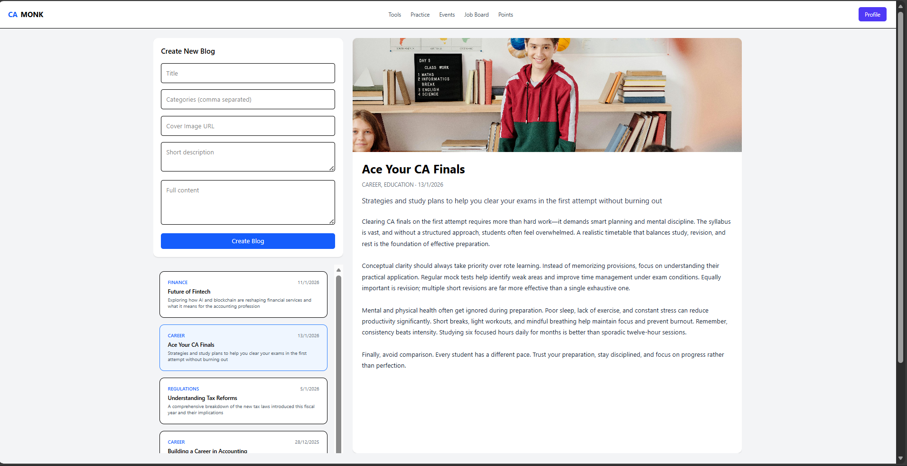

# CA Monk – Blog Application

A modern blog application built as part of the CA Monk Frontend assignment.  
The app allows users to view blogs, read blog details, and create new blogs using a clean and responsive UI.

---

## 🚀 Features

- View all blogs
- View blog details
- Create a new blog
- Responsive layout (desktop & mobile)
- Sticky header and clean UI
- Loading and error handling

---

## 📸 Screenshots

### Blog List & Detail View



## 🛠 Tech Stack

- **React + TypeScript**
- **Vite**
- **TanStack Query** – Server state management
- **Tailwind CSS** – Styling
- **shadcn/ui** – UI component patterns
- **JSON Server** – Mock backend API

---

## 📁 Project Structure

src/
├── api/ # API calls
├── components/ # UI components
├── hooks/ # TanStack Query hooks
├── layouts/ # Layout components
├── pages/ # Page-level components
├── types/ # TypeScript types


---

## ▶️ Running the Project Locally

### 1. Install dependencies
```bash
npm install

2. Start the backend (JSON Server)
npm run server

Backend runs on:
http://localhost:3001

3. Start the frontend
npm run dev

App runs on:
http://localhost:5173
```

| Method | Endpoint   | Description       |
| ------ | ---------- | ----------------- |
| GET    | /blogs     | Get all blogs     |
| GET    | /blogs/:id | Get blog by ID    |
| POST   | /blogs     | Create a new blog |


✅ Assignment Requirements Covered

TanStack Query for data fetching and mutations

Proper Tailwind CSS usage

shadcn/ui integration

Clean folder structure

Loading and error states

Responsive design

UI and UX polish

---

## ✅ How to apply it

1. Create or open `README.md` in your project root
2. Paste the content above
3. Save the file
4. Run:

```bash
git add README.md
git commit -m "Update README with project details"
git push origin main


📌 Author

Chaitanya B
